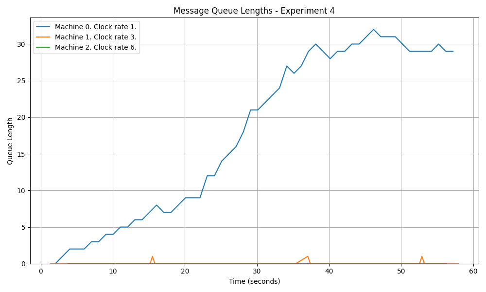
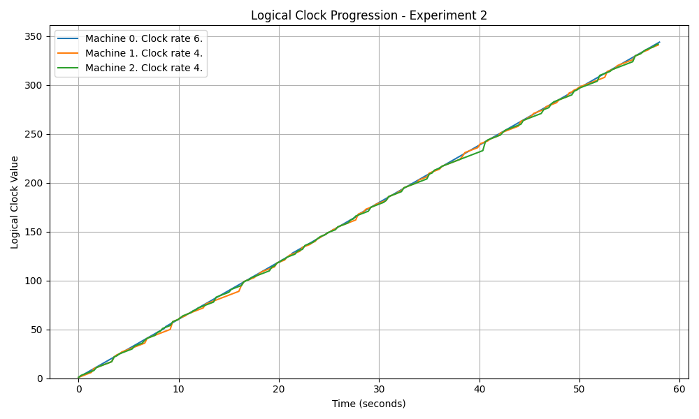

# Engineering notebook

## Design Decisions

### Overall Architecture
We're implementing a simulation of 3 virtual machines running at different clock rates. Each virtual machine is implemented as a Python object running in its own multi-process. The clocks are logical clocks following Lamport's model.

Communication between machines is handled via TCP sockets. Each machine maintains its own logical clock following Lamport's logical clock rules.

### Virtual Machine Design
Each VM has
  - A unique ID
  - A clock rate (1-6 ticks per second)
  - A logical clock
  - A message queue for incoming messages
  - Socket connections to other process VMs
  - A dedicated log file

### Communication Protocol
- Simple text-based protocol where messages contain the sender's logical clock value
- TCP sockets ensure reliable delivery of messages
- Each VM listens on a specific port and connects to the ports of other VMs

### Clock Synchronization
We use Lamport's logical clock algorithm.
  - Increment clock on internal events
  - When sending a message, increment clock and include it in the message
  - When receiving a message, set local clock to max(local_clock, received_clock) + 1

### Logging Strategy
- Each VM logs to its own file to avoid synchronization issues
- Log entries include:
  - System timestamp (for analysis)
  - Event type (internal, send, receive)
  - Queue length (for receive events)
  - Logical clock value

### Simulation Control
- Main program initializes VMs with random clock rates
- Runs the simulation for a fixed time (60 seconds)
- Gracefully shuts down all VMs at the end

## Implementation Notes

- Using Python's multi-processing module for concurrency
- Using standard socket library for network communication
- Using queue.Queue for multi-process-safe message queuing
- Using Python's logging module for structured logging

## Implementation Details

### Robust Communication
- Added connection retry logic to handle race conditions during startup
- Implemented timeout handling for socket operations
- Added reconnection logic if a connection fails during message sending
- Used a lock to protect access to the connections dictionary

### Improved Logging
- Structured log format with timestamps and event types
- Clear distinction between INTERNAL, SEND, and RECEIVE events
- Logging queue length for analysis of message backlog
- Logging final logical clock value when machine stops

### Error Handling
- Graceful handling of connection failures
- Proper cleanup of resources when stopping
- Timeout-based loop control to allow clean shutdown

### multi-process Safety
- Using multi-process-safe Queue for message handling
- Using locks for shared resource access
- Daemon multi-processs to ensure clean program exit

## Experiment Plan

For each experiment, we'll run the simulation for 60 seconds with 3 virtual machines. 

First, we consider experiments where the probability of an event being internal is 70%:

### Experiment 1: Default Settings
- Clock rates: Random between 1-6 ticks/second
- Event probabilities: 30% send, 70% internal (as specified)

### Experiment 2: Specific Clock Rates (Smaller variations in clock rates)
- Clock rates: [6, 4, 4] ticks/second
- Event probabilities: 30% send, 70% internal

### Experiment 3: Uniform Clock Rate (Even smaller variations in clock rates)
- Clock rates: [3, 3, 3] ticks/second
- Event probabilities: 30% send, 70% internal

### Experiment 4: Big Clock Differences
- Clock rates: [1, 3, 6] ticks/second
- Event probabilities: 30% send, 70% internal

### Experiment 5: Small Clock Differences
- Clock rates: [5, 3, 2] ticks/second
- Event probabilities: 30% send, 70% internal

### Experiment 6: More Communication with Small Clock Differences
- Clock rates: [5, 3, 2] ticks/second
- Event probabilities: 60% send, 40% internal

### Experiment 7: High Communication with Uniform Clocks
- Clock rates: [3, 3, 3] ticks/second
- Event probabilities: 90% send, 10% internal

### Experiment 8: High Communication with Mixed Clocks
- Clock rates: [4, 4, 6] ticks/second
- Event probabilities: 90% send, 10% internal

### Experiment 9: High Communication with Extreme Clock Difference
- Clock rates: [1, 1, 6] ticks/second
- Event probabilities: 90% send, 10% internal

### Experiment 10: High Communication with Big Clock Differences
- Clock rates: [1, 4, 6] ticks/second
- Event probabilities: 90% send, 10% internal

### Experiment 11: High Communication with Small Clock Differences
- Clock rates: [5, 3, 2] ticks/second
- Event probabilities: 90% send, 10% internal
### Experiments 12-15: used  for scatter plots for different communication probabilities
### Experiment 12: Low Communication with Big Clock Differences
- Clock rates: [1, 3, 6] ticks/second
- Event probabilities: 10% send, 90% internal

### Experiment 13: Default Communication with Big Clock Differences
- Clock rates: [1, 3, 6] ticks/second
- Event probabilities: 30% send, 70% internal

### Experiment 14: More Communication with Big Clock Differences
- Clock rates: [1, 3, 6] ticks/second
- Event probabilities: 60% send, 40% internal

### Experiment 15: High Communication with Big Clock Differences
- Clock rates: [1, 3, 6] ticks/second
- Event probabilities: 90% send, 10% internal

For each experiment, we'll analyze:
1. Logical clock drift between machines
2. Message queue lengths
3. Frequency and size of logical clock jumps
4. Correlation between clock rates and logical clock progression 

## Experiment Execution

We've created a main.py script that can run all five experiments or a specific one:

```python main.py  # Run all experiments
python main.py --experiment 1  # Run a specific experiment 
```

Each experiment runs for 60 seconds by default, but this can be changed with the --duration parameter.

## Analysis Tools

We've created an analyze_logs.py script to help analyze the results of our experiments. This script:

1. Parses the log files from each machine
2. Calculates statistics about logical clock jumps and queue lengths
3. Counts different types of events
4. Generates plots showing:
   - Logical clock progression over time
   - Message queue lengths over time

To run the analysis:

```
python analyze_logs.py
```

The script will generate PNG files with the plots for each experiment.

## Expected Results

We expect to observe:

1. In experiments with varying clock rates, faster machines will process more events and have higher logical clock values
2. Machines with slower clock rates will likely have longer message queues
3. When a slow machine receives a message from a fast machine, we expect to see larger jumps in the logical clock
4. Higher communication probability should lead to more synchronization between machines
5. Uniform clock rates should result in more consistent logical clock progression across machines

These hypotheses will be tested and analyzed after running the experiments.


## Experimental Observations

### Observation: Shorter Queue = More accurate Clocks
The process(es) with highest clock rate will always have the highest clock value. How close the clocks of the other processes with slower clock rates will be to this depends directly on the lengths of their message queues.

If a process gets messages more quickly than it can handle them, it will not see the current clock value of the sending process but the old clock value of the old message it is currently handeling. The longer the queue, the further the time stamp of the message it is currently handling is behind. 

A good example of this behaviour is example 4 with clock rates 1, 3, and 6. We can see that the process with clock rate 1 has an ever-increasing queue length, making its logical clock value be further and further behind since it can never catch up to the current messages from the faster processes with the current highest clock value in the system.  In contrast, the process with clock rate 3 sometimes has a queue of messages build up but eventually always returns back to an empty queue. At those points, its clock catches up to the clock of the process with clock time 6.


| Queue Lengths | Logical Clock Times |
|--------------|---------------------|
|   | |


We can quantify this:
- The process with clock rate 1 (we'll call it CR1) has a clock drift time that is about half as fast as CR3 and CR6, i.e. in the same amount of real time, the logical clock of CR6 or CR3 moves forward by about twice as many steps as the clock in CR1. This makes sense: In x time steps of the logical clock CR6, it sends about x/5 messages to CR1. Simultaneously, CR3 sends about x/10 messages to CR1. In this time, CR1 thus gets about 3x/10 messages and can handle x/6 of them, so a 10/18 (roughly 1/2) fraction of them. Thus, its clock will have increased by about x/2 time steps. 
- CR3's logical clock grows at approximately the same speed as the logical clock of CR6. Since CR6 rate is twice as high as CR3s, this means it has half the jump time, i.e. mean time between two logged opperations. CR3s rate is 3 times as high as CR1's, who's clock however also only updates at roughly half the speed, so their jump times will be in a ratio of 2:3.

Another interesting example is Example 1. Machine 1, at a clock rate of 2, constantly has a small message queue - it is never empty but never too big. Thus, this processes clock is constantly close to the clock of the fast processes with clock rate 6 - it doesn't 'drift away' - but still constantly behind. 

| Queue Lengths | Logical Clock Times |
|--------------|---------------------|
|   | |


Looking at example 2, we can see that at 70% internal probability, if the clock rates are close enough to each other, in this example 4, 4, 6, no message queue buildup happens and thus the clocks of the slower processes frequently catch up to the clock of the process at rate 6.

| Queue Lengths | Logical Clock Times |
|--------------|---------------------|
|   | |


We briefly discuss how the message queue buildup may lead to unwanted results in a real distributed system:

In our case, the process only sends messages or does internal actions when its message queue is empty. Thus, a process with too low clock speed would effectively halt its operations which may lead for the overall distributed system to behave unexpectedly or not make progress.

Even worse errors can happen in this case if processes may also send messages even though there message queue is not empty. Since they still have unseen messages, potentially from 'future' clock times, concurrency issues would arise. 

### Observation: Message queue buildup depends on internal percentage
We've seen above with example 2 that with internal probability 70%, no concerning message buildup happens if the clock rates are similar enough. However, how close the rates need to be for no message queue buildup to happen (which in return causes this process' clock to drift away in time), depends on the probability of the processes performing an internal action.

We can observe this by comparing examples 5 (70% internal), 6 (40% internal), and 11 (10% internal), all with clock rates 5,3,2. In example 5, no message queue buildup happens (in fact, no message queue is ever longer than 2), so all clocks frequently catch up to each other (even thought it may take the clock with rate 2 a bit longer at times). In example 6, with a higher message send probability, we can observe that CR3 still catches up to CR5 very frequently, while CR2 drifts away due to a message buildup. Lastly, in example 11, with even higher message send probability, we can observe that both CR2 and CR3 drift away due to message queue buildup. CR2 drifts away more severly while CR3 eventually catches up to CR5, but only after around 50 seconds.

| Queue Lengths | Queue Lengths | Queue Lengths |
|--------------|---------------|---------------|
|  |  |  |
| **Logical Clock Times** | **Logical Clock Times** | **Logical Clock Times** |
|  |  |  |


We ran a similar example with similar outcomes in experiments 12 through 15, with clock rates 1,3,6, and internal percentages of 90, 70, 40, 10. The observation that higher message send probability leads to longer message queue buildup is shown in these plot comparing these 4 experiements.

| Communication Probability Analysis |
|-----------------------------------|
|  |


This observation has interesting implications for practice. If our distributed system sends message fairly infrequently, we can accept the internal clock rates to be quite far apart. However, for distributed systems with more communication, in particular systems where the number of messages send by a process is on the order of time steps, we need to have the clock rates be closer to each other to ensure no message buildup happens and the system works as intended.


### Observation: Big Jumps
Big jumps in a processes clock can occur when it either didn't receive messages in a long time by any process with a higher clock, or it if has many messages in the queue, but some of those messages were sent with a lot of time in between. Thus, this problem can occur if the processes send messages fairly infrequently and run at different rates. An example of such a large jump happening can be seen for CR3 in example 4 at (real) time around 23 seconds - after not having received messages from CR6 for about 7 seconds of real time it receives a messages, causing a big logical clock jump of 20 (around (6-3*7)).

| Queue Lengths | Logical Clock Times |
|--------------|---------------------|
|   | |


Similarly, we can observe that with high communication probability, the logical clocks of the slower processes more quickly catch up to the clock of the fastest process, so less big jumps occur. This can be seen in example 8, where even though one of them has a clock rate of 4, it is almost entirely in sync with the two having clock rate 6. However, this is limited to cases where the communication probability isn't so high (together with big differences in clock rates) that message queue buildup happens, which can lead to the clock of the slower process permanently being behind, as discussed above.

| Queue Lengths | Logical Clock Times |
|--------------|---------------------|
|   | |


In our opinion, big jumps aren't anything bad for the system in itself, but can be a result of other 'bad' things that can happen, in particular message queue buildup.


### Main takeaways
- The process with the highest clock rate has the highest clock value. How close the clocks of the other processes with slower clock rates will be to this depends directly on the lengths of their message queues.
- The longer the queue, the more time drift.
- Increased message send probability and relateively lower clock rates lead to longer message queues.
- If no message queue buildup happens, a higher communication probability leads to more frequent synchronization and smaller jumps. In that sense, a high communication probability is efficient for synchronization up to a certain threshold, that is the threshold for queue buildup of the slower clock rates.
- A system with a lot more VMs with the same communication protocol will have a higher receiving rate even at a low message send probability (since a message could get brodcasted to all processes), and might therefore struggle with queue buildup for the slower clock rates.
- In general, we can say that a distributed system with more communication (due to many processes or each process sending many messages) requires clock rates to be more similar.
- More even clock rates together with a high communication probability will lead to a more synchronized system.